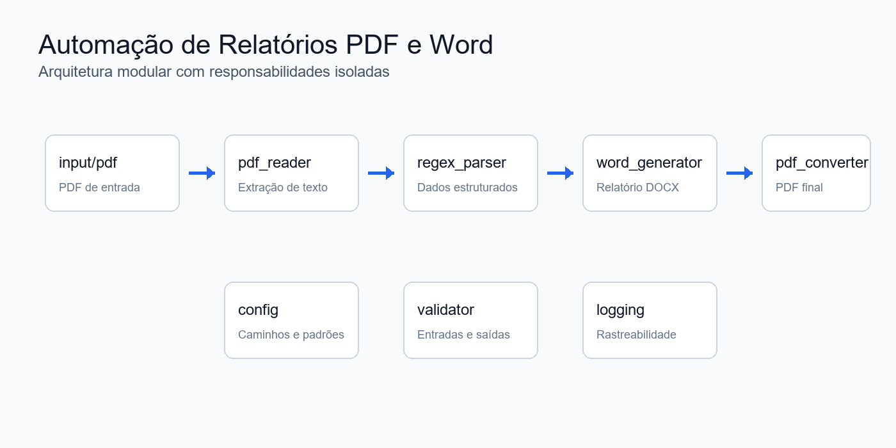
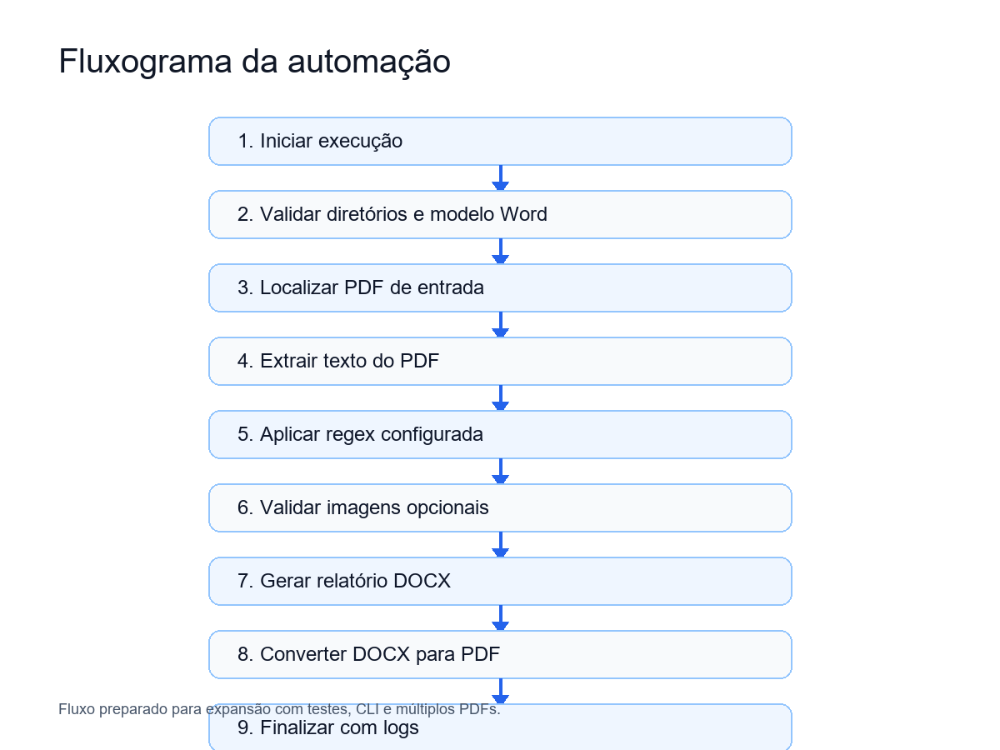
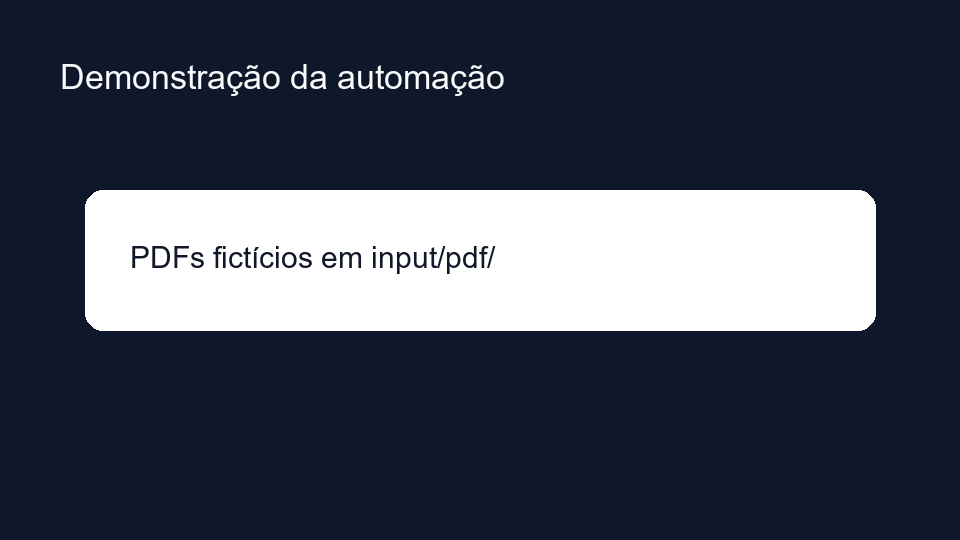

# Automação de Relatórios PDF e Word



Automação em Python para extrair informações de arquivos PDF, estruturar os dados com expressões regulares, preencher um modelo Word e gerar um relatório final em PDF.

O projeto foi organizado com foco em portfólio, manutenção e evolução: módulos pequenos, responsabilidades bem definidas, configuração centralizada, logs, tratamento de exceções e documentação em português.

## Problema resolvido

Processos manuais de criação de relatórios costumam envolver leitura de PDFs, cópia de informações, montagem de documentos Word, inclusão de imagens e exportação final para PDF. Esse fluxo é repetitivo, sujeito a erros humanos e difícil de escalar.

## Solução

Este projeto automatiza o fluxo de ponta a ponta:

1. Localiza um PDF de entrada.
2. Extrai o texto do documento.
3. Aplica padrões regex para capturar campos relevantes.
4. Valida imagens opcionais.
5. Preenche um modelo Word com placeholders.
6. Converte o relatório gerado para PDF.
7. Registra logs organizados durante a execução.

## Arquitetura


Cada módulo possui uma única responsabilidade:

- `main.py`: orquestra o fluxo principal.
- `config.py`: centraliza caminhos e padrões configuráveis.
- `pdf_reader.py`: extrai texto de PDFs.
- `regex_parser.py`: transforma texto livre em dados estruturados.
- `word_generator.py`: gera o relatório Word a partir do modelo.
- `image_handler.py`: valida imagens usadas no relatório.
- `pdf_converter.py`: converte DOCX para PDF.
- `validator.py`: valida entradas e saídas obrigatórias.
- `utils.py`: reúne utilidades compartilhadas.

## Fluxograma



## Tecnologias utilizadas

- Python 3.11+
- pdfplumber
- python-docx
- docx2pdf
- Pillow
- Logging nativo do Python
- Expressões regulares com `re`

## Estrutura do projeto

```text
automacao-relatorios-pdf-word/
├── README.md
├── LICENSE
├── requirements.txt
├── .gitignore
├── src/
│   ├── main.py
│   ├── pdf_reader.py
│   ├── regex_parser.py
│   ├── word_generator.py
│   ├── image_handler.py
│   ├── pdf_converter.py
│   ├── validator.py
│   ├── config.py
│   └── utils.py
├── templates/
│   └── modelo_relatorio.docx
├── input/
│   ├── pdf/
│   └── images/
├── output/
├── docs/
│   ├── architecture.png
│   ├── workflow.png
│   └── demo.gif
├── examples/
│   ├── exemplo.pdf
│   └── imagens/
└── tests/
```

## Como instalar

Clone o repositório:

```bash
git clone https://github.com/seu-usuario/automacao-relatorios-pdf-word.git
cd automacao-relatorios-pdf-word
```

Crie e ative um ambiente virtual:

```bash
python -m venv .venv
.venv\Scripts\activate
```

Instale as dependências:

```bash
pip install -r requirements.txt
```

## Como executar

1. Adicione um arquivo PDF em `input/pdf/`.
2. Adicione imagens opcionais em `input/images/`.
3. Ajuste os placeholders do arquivo `templates/modelo_relatorio.docx`, se necessário.
4. Execute:

```bash
python src/main.py
```

O relatório final será gerado em:

```text
output/relatorio_gerado.pdf
```

O log da execução será salvo em:

```text
output/automacao.log
```

## Como executar os testes

Os testes usam `unittest`, biblioteca padrão do Python:

```bash
python -m unittest discover tests
```

## Exemplo de uso

O modelo Word usa placeholders no formato:

```text
{{titulo}}
{{cliente}}
{{data}}
{{resumo}}
```

Os padrões de extração ficam centralizados em `src/config.py`:

```python
DEFAULT_REGEX_PATTERNS = {
    "titulo": r"Título:\s*(?P<valor>.+)",
    "cliente": r"Cliente:\s*(?P<valor>.+)",
    "data": r"Data:\s*(?P<valor>.+)",
    "resumo": r"Resumo:\s*(?P<valor>[\s\S]+)",
}
```

## Prints


## GIF demonstrativo



## Qualidade de código

O projeto foi preparado seguindo boas práticas de engenharia:

- Responsabilidade única por arquivo.
- Funções pequenas e reutilizáveis.
- Type hints nos pontos principais.
- Docstrings em português.
- Tratamento de exceções com mensagens amigáveis.
- Logs centralizados em arquivo e console.
- Estrutura pronta para testes automatizados.
- Separação entre entrada, saída, exemplos, documentação e código-fonte.

## Roadmap

- Adicionar testes unitários com `pytest`.
- Permitir configuração de regex por arquivo externo.
- Criar interface de linha de comando com argumentos.
- Adicionar suporte a múltiplos PDFs por execução.
- Criar etapa de validação dos campos obrigatórios extraídos.
- Automatizar geração de artefatos de demonstração para o README.
- Configurar integração contínua no GitHub Actions.

## Licença

Este projeto está licenciado sob a licença MIT. Consulte o arquivo [LICENSE](LICENSE) para mais detalhes.
